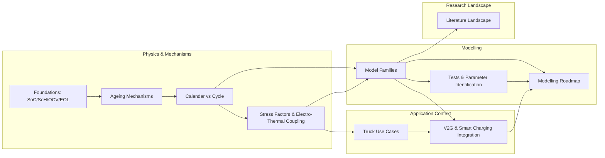

# CONTENT_MAP.md — Concept Map

Free navigation between nodes; each node has an internal logical path (intuition → equations → tool → deeper).

## Nodes, depth layers, and tools

| Node (slug) | Core (default) | Clarify (simpler) | Deeper (advanced) | Interactive tool |
|---|---|---|---|---|
| foundations | SoC/OCV, plural SoH, EOL/RUL definitions | fuel-gauge & marathon analogies | coulomb-counting drift, LFP hysteresis | — |
| mechanisms | SEI, plating, LAM, impedance, gas; NMC vs LFP | hotel/garage/paperclip analogies | √t derivation, anode-potential kinetics, balancing shift | mechanism-diagram (animated SVG) |
| calendar-vs-cycle | definitions, drivers, superposition | parked-car vs driven-car framing | 3 ways superposition breaks; test separation math | calendar-explorer |
| stress-factors | T/SoC/DoD/C-rate factors, electro-thermal loop | per-factor analogies | per-mechanism Ea, multiplicative-separability critique | arrhenius + soc-window |
| truck-use-cases | duty-cycle archetypes, FEC/day, MCS, depot | car-vs-truck contrasts | rainflow micro-cycle counting | cycle-explorer |
| model-families | empirical → semi-empirical → mechanistic → electro-thermal → ML | map/ladder framing | Tafel SEI current, DFN cost ladder | calendar-explorer (model = the one on screen) |
| parameter-identification | test matrices, RPT, fitting, validation | cooking-recipe calibration analogy | identifiability, cell-to-cell statistics | — |
| v2g-integration | services, marginal degradation cost, optimisation embedding | battery-as-rental-asset analogy | linearisation for MILP/MPC, rolling horizon | v2g-dispatch |
| roadmap | 5-step thesis pipeline + decision tree | — (process content) | plating-aware extensions, knee prediction | (reuses v2g-dispatch) |
| literature | reading map by category + paper-reading checklist | — | — | — |

## Quality-check coverage (per spec §9)

- Temperature tool ✔ (arrhenius, calendar-explorer)
- SoC window tool ✔ (soc-window)
- C-rate / DoD tool ✔ (cycle-explorer)
- V2G dispatch tool ✔ (v2g-dispatch)
- Misconception callouts in every section ✔
- Modelling roadmap thesis-ready ✔ (node `roadmap` + docs/MODELLING_ROADMAP.md)
