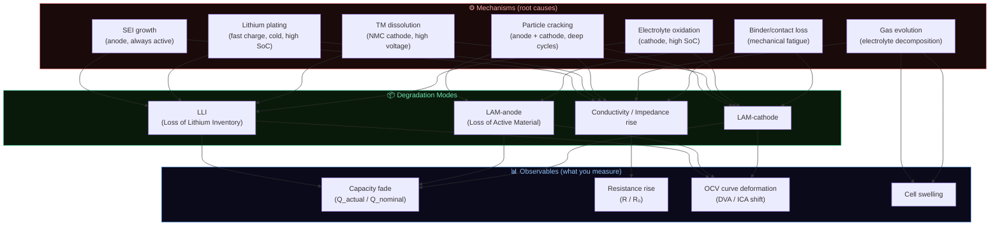
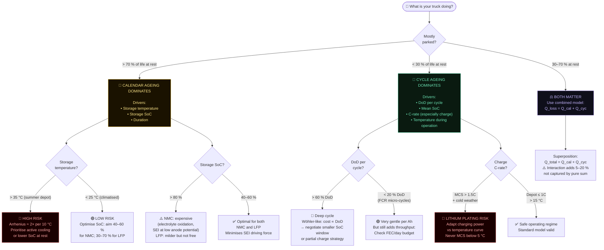
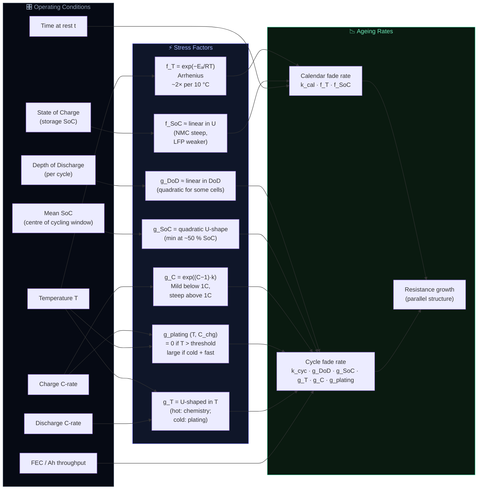
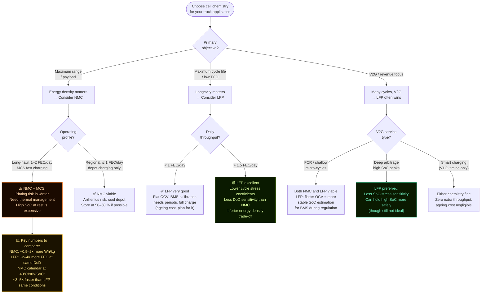
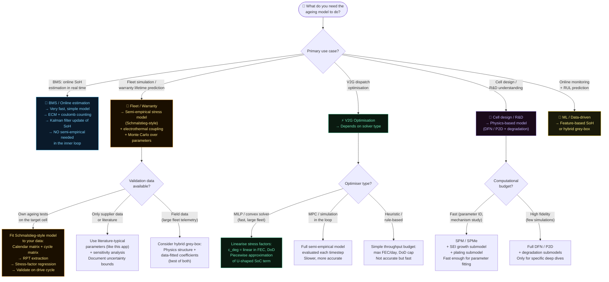
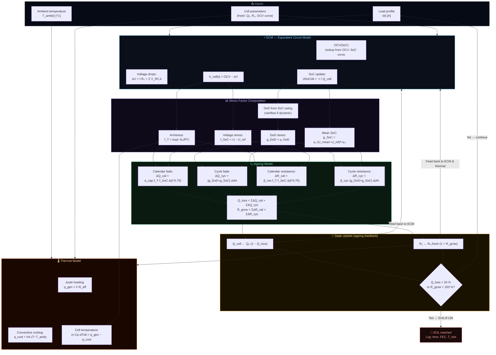
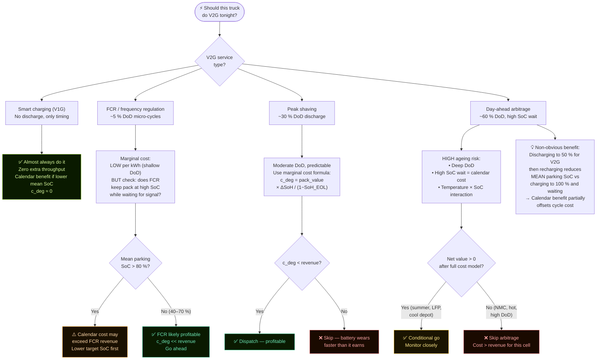

# Battery Ageing Modelling — Flowcharts & Decision Trees

All diagrams use [Mermaid](https://mermaid.js.org/) syntax — rendered automatically in GitHub, Notion, VS Code, and Obsidian.

---

## 1. What happens inside an ageing cell? (Mechanism → Mode → Observable)

---

## 2. Calendar vs Cycle ageing — which dominates for your truck?

---

## 3. Stress factor map — what drives what

---

## 4. NMC vs LFP — which chemistry for which truck application?

---

## 5. Ageing model selection — what model for what question?

---

## 6. Schmalstieg 2014 model — full data flow

---

## 7. V2G ageing cost — decision framework

---

## 8. Parameter identification workflow (Schmalstieg method)

```mermaid
flowchart TD
    START([🧪 You have a new cell.\nHow do you fit the\nSchmalstieg model?]) --> PLAN

    PLAN["Step 0: Plan the test matrix\nCalendar: ≥3 temps × ≥6 SoCs × ≥6 months\nCycle: ≥3 DoDs × ≥3 mean SoCs × fixed T & C-rate\nMin. 3 cells/condition for scatter estimate\nFix RPT protocol (C/5 capacity + 10 A pulse resistance)"]

    PLAN --> CAL_TEST["📅 Run calendar tests\nStore cells at constant T and SoC\nRun RPT every 30 days\nRecord Q(t) and R(t) per condition"]

    CAL_TEST --> CAL_FIT["Fit per condition:\nQ_loss(t) = A_i · t^z\n→ Get A_i and z per condition\nExpect z ≈ 0.5–0.85\n(often fix at 0.75 for NMC)"]

    CAL_FIT --> ARR_FIT["Arrhenius fit:\nFor each SoC, plot ln(A_i) vs 1/T\nSlope = −Eₐ/R → extract Eₐ\n(expect 40–60 kJ/mol for NMC/graphite)"]

    ARR_FIT --> SOC_FIT["SoC stress fit:\nNormalise A_i by exp(−Eₐ/RT)\nPlot normalised coeff vs cell voltage U\nFit line → get α_cap and U_ref"]

    SOC_FIT --> RES_CAL["Repeat for resistance R_grow,cal:\nGet β_res and E_a,R"]

    RES_CAL --> CYC_TEST["🔄 Run cycle tests\nCycle at fixed T & C-rate\nVary DoD and mean SoC\nRun RPT every 25 cycles"]

    CYC_TEST --> SUBTRACT["⚠️ Subtract calendar contribution!\nQ_cyc,isolated = Q_total − Q_cal(t_elapsed, T, U_mean)\nThis step is critical — skip it and\nyou overfit the cycle parameters"]

    SUBTRACT --> CYC_FIT["Fit per cycle condition:\nQ_loss,cyc = α_cyc · Ah^z_cyc\nGet α_cyc per (DoD, mean SoC)"]

    CYC_FIT --> DOD_FIT["DoD stress fit:\nPlot α_cyc vs DoD → fit γ₁ (slope)\nExpect near-linear for NMC"]

    DOD_FIT --> MSOC_FIT["Mean SoC fit:\nFor fixed DoD, plot α_cyc vs U_mean\nFit quadratic → get γ₂ (curvature)\nand γ₃ (baseline minimum)"]

    MSOC_FIT --> COUPLE["⚙️ Couple to electrothermal model\nLink ECM + thermal node\nPass actual T and V to ageing model\n(not set-point T and V!)"]

    COUPLE --> VALIDATE["✅ Validate on dynamic profiles\nRun representative truck duty cycle\nthrough coupled model\nCompare Q and R predictions to RPT data\nTarget: error < 15 %"]

    VALIDATE --> Q2{Error < 15 %?}
    Q2 -->|"Yes"| DONE["🏁 Model ready\nDocument: parameters, validity bounds,\ntest matrix range, known gaps\n(plating at low T, C-rate dependence)"]
    Q2 -->|"No"| DEBUG["🔍 Debug:\nWhich condition has highest residual?\nIf calendar: check Arrhenius fit or\nsubstract step\nIf cycle: check DoD or mean-SoC fit\nIf dynamic: check electrothermal coupling"]
    DEBUG --> VALIDATE

    style PLAN fill:#060a14,stroke:#475569,color:#94a3b8
    style SUBTRACT fill:#1a0800,stroke:#f97316,color:#fed7aa
    style COUPLE fill:#0f0a1a,stroke:#a78bfa,color:#c4b5fd
    style VALIDATE fill:#0a1a10,stroke:#34d399,color:#6ee7b7
    style DONE fill:#0a1a00,stroke:#84cc16,color:#d9f99d
    style DEBUG fill:#1a0a0a,stroke:#f87171,color:#fca5a5
```

---

## 9. Thesis planning — 5-step pipeline

```mermaid
flowchart LR
    S1["📝 Step 1\nDefine the question\n\n• What SoH metric?\n  (capacity, resistance, both)\n• What EOL criterion?\n  (80 % cap? Power limit?)\n• What output?\n  (RUL? €/kWh? SoH at year N?)"]

    S2["🧩 Step 2\nChoose model family\n\n• BMS → simple ECM\n• V2G dispatch → semi-empirical\n  (linearisable)\n• Warranty → semi-empirical\n  + uncertainty bounds\n• R&D → physics-based"]

    S3["🧪 Step 3\nData strategy\n\n• Own tests (best, 12–24 mo)\n• Supplier NDA data\n• Public datasets\n  (NASA / Oxford)\n• Literature-typical\n  + sensitivity analysis"]

    S4["⚙️ Step 4\nIdentification & validation\n\n• Fit per condition\n• Subtract calendar from cycle\n• Stress-factor regression\n• Validate on DYNAMIC profiles\n  (not just matrix points!)\n• Report uncertainty bands"]

    S5["⚡ Step 5\nV2G / TCO integration\n\n• Timestep separation:\n  seconds (ECM) vs days (ageing)\n• Accumulate stress stats\n• Rolling SoH update\n• Marginal cost pricing\n• Sensitivity to Ea, DoD exponent"]

    S1 -->|"Metric dictates model"| S2
    S2 -->|"Model dictates data needs"| S3
    S3 -->|"Data enables fitting"| S4
    S4 -->|"Validated model → simulation"| S5

    style S1 fill:#0a0f1a,stroke:#38bdf8,color:#7dd3fc
    style S2 fill:#0f0a1a,stroke:#a78bfa,color:#c4b5fd
    style S3 fill:#1a0f00,stroke:#f59e0b,color:#fde68a
    style S4 fill:#0a1a10,stroke:#34d399,color:#6ee7b7
    style S5 fill:#1a0800,stroke:#f97316,color:#fed7aa
```

---

## How to render these diagrams

- **GitHub**: automatically rendered in any `.md` file — just push and view
- **VS Code**: install "Markdown Preview Mermaid Support" extension → Ctrl+Shift+V
- **Obsidian**: native Mermaid support, no plugin needed
- **Export to PNG/SVG**: paste any diagram block at [mermaid.live](https://mermaid.live) and download
